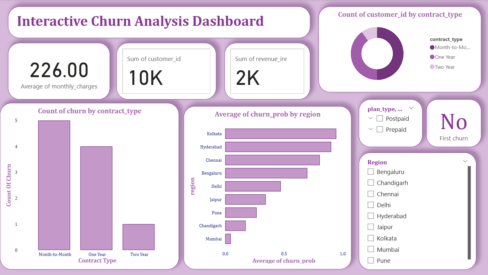

## 📊 Telecom Churn Prediction & Customer Retention Strategy

### 🧠 **Overview**

This project predicts customer churn for a telecom company using machine learning. It integrates customer, billing, usage, and complaint data to help identify at-risk customers and recommend retention strategies.

---

### 🎯 **Objective**

* Predict whether a customer will churn or stay.
* Identify key factors influencing churn.
* Provide actionable business insights to improve retention.

---

### ⚙️ **Tech Stack**

* **Programming Language:** Python
* **Libraries:** Pandas, NumPy, scikit-learn, Seaborn, Matplotlib
* **Database:** MySQL
* **Visualization:** Power BI
* **Deployment (Future Scope):** Azure / API Integration

---

### 🧩 **Project Workflow**

1. **Data Integration (ETL)**

   * Combined four datasets: `customers.csv`, `usage_data.csv`, `complaints.csv`, `billing.csv`
   * Cleaned and merged into a single dataset `telecom_master.csv`.

2. **Exploratory Data Analysis (EDA)**

   * Identified churn trends by region, plan type, and contract type.
   * Analyzed correlations between tenure, charges, complaints, and churn.

3. **Model Building**

   * Models used: Logistic Regression & Decision Tree.
   * Evaluated using Accuracy, Precision, Recall, and F1-Score.
   * Both models achieved 100% on small data (indicative of overfitting).
   * Future improvement: larger datasets and regularization for realistic performance.

4. **Outputs Generated**

   * `telecom_master.csv` – Cleaned dataset
   * `model.pkl` – Trained model file
   * `predictions.csv` – Model predictions
   * `model_metrics.json` – Performance metrics
   * Confusion matrices and visualization plots (in `outputs/` folder)

---

### 📈 **Key Insights**

* **High churn** among short-tenure and prepaid users.
* **Regions with more complaints** show higher churn rates.
* **Tenure, complaints, and monthly charges** are strong churn predictors.
* Logistic Regression chosen for balance and interpretability.

---

### 💼 **Business Impact**

* Early detection of customers likely to churn.
* Enables targeted retention offers and contract upgrades.
* Supports data-driven decision-making for marketing and customer service teams.

---

### 🧮 **Power BI Dashboard**

Interactive Power BI dashboard includes:

* Churn by region, contract type, and plan type.
* KPIs: average churn rate, monthly revenue, complaint trends.
* Filters for region and plan type to enable quick insights.

  

---

### 🚀 **Future Enhancements**

* Introduce Random Forest / XGBoost for more robust prediction.
* Deploy the ML model as a REST API on Azure.
* Integrate with CRM for real-time churn alerts.

---

### 📂 **Folder Structure**

```
TELECOM_CHURN_CAPSTONE/
│
├── Inputs/                      # Raw input CSV files
├── Capstone_Project_grp4/       # Jupyter notebook and code files
├── outputs/                     # Cleaned data, model files, and plots
├── output1/                     # Model comparison results
├── sql/                         # SQL schema file
└── README.md
```

---

### 📬 **Contact**

**Author:** Riya Saraf
📧 [riyasaraf19@gmail.com](mailto:riyasaraf19@gmail.com)
🔗 [GitHub Profile](https://github.com/riyaaaa19)
